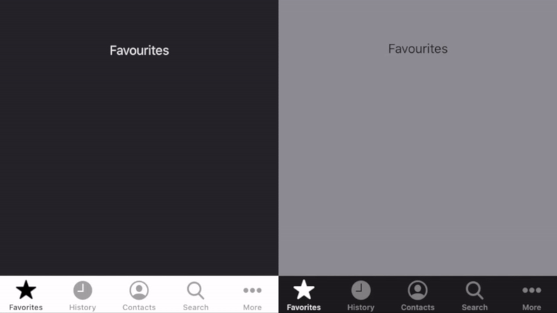
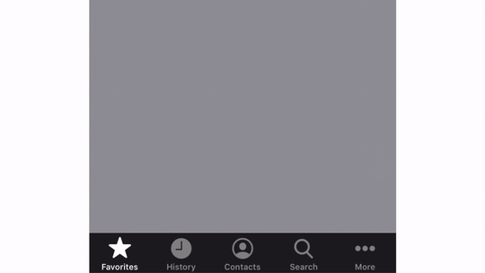

# ExpandedTabBar v3.0.0
    


**ExpandedTabBar** is a very creative designed solution for "more" items in UITabBarController. It's greate experience to have more comfortable and intuitive UI.


#

- *[Requirements](#requirements)*
- *[Installation Guide](#installation)*
    - *Cocoapods*
    - *Swift Package Manager*
- *[Flow Setup](#flow-setup)*
    - *With Storyboard* 
    - *Programmatically* 
- *[Delegation](#delegation)*
- *[Customization](#customization)*
    - *More Tab* 
    - *Light/Dark Mode Support* 
    - *Options Customization* 
- *[Examples](#examples)*
- *[Support](#support)*
- *[Let us know!](#let-us-know)*
- *[License](#license)*

## Requirements

- **iOS 11.0 +**
- **Swift 5.﹡**
- **XCode 10 +**

## Installation

**ExpandedTabBar** doesn't contain any external dependencies.

*These are currently the supported intllation options:*
  
### 1. [CocoaPods](https://cocoapods.org/)
To integrate **ExpandedTabBar** into your Xcode project using CocoaPods, specify it in your `Podfile`:
```ruby
use_frameworks!

target '<Your Target Name>' do
    pod 'ExpandedTabBar'
end
```
### 2. [Swift Package Manager](https://swift.org/package-manager/)

The  **Swift Package Manager** is a tool for automating the distribution of Swift code and is integrated into the  `swift`  compiler. It is in early development, but appstore-card-transition does support its use on supported platforms.

Once you have your Swift package set up, adding **ExpandedTabBar** as a dependency is as easy as adding it to the  `dependencies`  value of your  `Package.swift`.
```swift
dependencies: [
    .package(url: "https://github.com/yervandsar/ExpandedTabBar", from: "3.0.0")
]
```
 Or you can checkout [Adding Package Dependencies to Your App](https://developer.apple.com/documentation/xcode/adding_package_dependencies_to_your_app) *by **Apple***

## Flow Setup
- #### *With Storyboard*
1.  Create  `UITabBarController`
2.  Extend from  `ExpandedTabBarController`
3.  Set to  `UITabBarController`  in storyboard

- #### *Programmatically*
```swift
let viewControllers: [UIViewController] = [...] // Array of view controllers for UITabBarController
let expandedTabBar = ExpandedTabBarController()
expandedTabBar.setup(viewControllers: viewControllers)
```
**NOTE:** any `UIViewController` in `viewControllers` array must have `tabBarItem`.

## Delegation

For tab selection action implement  `ExpandedTabBarControllerDelegate`:
```swift
func expandedTabBarController(
    _ tabBarController: UITabBarController,
    didSelect viewController: UIViewController,
    withItem tabBarItem: UITabBarItem?
)
```

## Customization

- #### *More Tab*
You can customize more tab in storyboard, or set programmatically.
```swift
moreTitle        : String   // Default "More"
moreIcon         : UIImage? // Default Image from SystemItem.More
moreSelectedIcon : UIImage? // Default nil
```
- #### *Dark Mode Support*
**ExpandedTabBar** is fully ***Light/Dark*** mode supported and for setting any `UIColor` or `CGColor` you can use.
```swift
let color: UIColor/CGColor = .pattern(light: UIColor, dark: UIColor)
```
**NOTE:** If device OS version not supports dark mode, it will take light color by default.
- #### *Options Customization*
**ExpandedTabBar** options conforms to **Options** protocol.

```swift
public  protocol  Options: AnyObject {
    var  background   : BackgroundOptions
    var  container    : ContainerOptions
    var  animationType: AnimationType
    var  indicatorType: IndicatorTypes
}
```
-- *Background Options*
```swift
public protocol  BackgroundOptions: AnyObject {
    var color     : UIColor // Default .clear
    var alpha     : CGFloat // Default 0.3
    var closeOnTap: Bool    // Default true
}
```
-- *Container Options*
```swift
public protocol  ContainerOptions: AnyObject {
    var color       : UIColor             // Default .pattern(light: .white, dark: .black)
    var alpha       : CGFloat             // Default 1.0
    var cornerRadius: CGFloat             // Default 10
    var bottomMargin: CGFloat             // Default 15
    var tabSpace.   : CGFloat             // Default 8
    var tab         : ContainerTabOptions
    var shadow      : ShadowOptions?      // Default nil
}
```
**NOTE:** For shadow you can see and use `ShadowOptionsDefault` class

-- *Container's Tab Options*
```swift
public protocol  ContainerTabOptions: AnyObject {  
    var itemHeight     : CGFloat.           // Default 35
    var titleFont      : UIFont             // Default .systemFont(ofSize: 16)
    var titleColor     : UIColor            // Default .pattern(light: .black, dark: .white)
    var iconColor      : UIColor            // Default .pattern(light: .black, dark: .white)
    var iconContentMode: UIView.ContentMode // Default .scaleAspectFit
    var iconTitleSpace : CGFloat            // Default 8
}
```
 -- *Animation Types*
 
 |  NoneAnimations | Translate  | Zoom  |  Rotate |
 :--------------------:|:-----------:|:--------:|:--------:|
 |`.none` |`.top`(Default)|`.zoomIn`|`.rotatePositive`|
 |||||
 |`.crossDissolve` |`.bottom`|`.zoomOut`|`.rotateNegative`|
 |||||
 | |`.left`|`.zoomX`| |
 | |||`.rotate(angle: CGFloat)`|
 |  |`.right`|`.zoomY`| |
 | ||| |
 
 **NOTE:** You can create your own animation `.custom(AnimationProtocol)`. You can use TransformAnimation for creating custom animations

-- *Indicator Types*
- `.none`
- `.line` 
- `.connectedLine` 
- `.triangle` 
- `.square`

**NOTE:** Default `.triangle`

## Examples
```swift
final class  CustomViewController: ExpandedTabBarController {

    override func  viewDidLoad() {
        super.viewDidLoad()
        expandedDelegate = self
        initOptions()
    }

    private func initOptions() {
        let container = options.container
        container.shadow = ShadowOptionsDefault()
        container.tabSpace = 15
        container.tab.iconTitleSpace = 15
    }
}

extension  CustomViewController: ExpandedTabBarControllerDelegate {

    func expandedTabBarController(_ tabBarController: UITabBarController,
                                    didSelect viewController: UIViewController,
                                    withItem tabBarItem: UITabBarItem?) {
        // Do some logic here
    }
}
```

## Support

Feel free to [open issuses](https://github.com/yervandsar/ExpandedTabBar/issues/new) with any suggestions, bug reports, feature requests, questions.

## Let us know!

We’d be really happy if you sent us links to your projects where you use our component. Just send an email to yervandsar@gmail.com And do let us know if you have any questions or suggestion regarding the animation.


### License

The MIT License (MIT)

Copyright (c) 2018 Yervand Saribekyan

Permission is hereby granted, free of charge, to any person obtaining a copy
of this software and associated documentation files (the "Software"), to deal
in the Software without restriction, including without limitation the rights
to use, copy, modify, merge, publish, distribute, sublicense, and/or sell
copies of the Software, and to permit persons to whom the Software is
furnished to do so, subject to the following conditions:

The above copyright notice and this permission notice shall be included in all
copies or substantial portions of the Software.

THE SOFTWARE IS PROVIDED "AS IS", WITHOUT WARRANTY OF ANY KIND, EXPRESS OR
IMPLIED, INCLUDING BUT NOT LIMITED TO THE WARRANTIES OF MERCHANTABILITY,
FITNESS FOR A PARTICULAR PURPOSE AND NONINFRINGEMENT. IN NO EVENT SHALL THE
AUTHORS OR COPYRIGHT HOLDERS BE LIABLE FOR ANY CLAIM, DAMAGES OR OTHER
LIABILITY, WHETHER IN AN ACTION OF CONTRACT, TORT OR OTHERWISE, ARISING FROM,
OUT OF OR IN CONNECTION WITH THE SOFTWARE OR THE USE OR OTHER DEALINGS IN THE
SOFTWARE.
